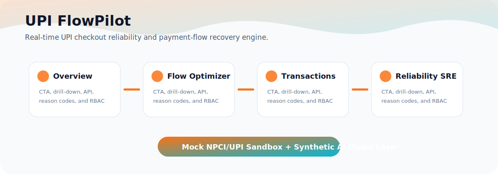

# UPI FlowPilot Concept-Specific Diagrams

  

  

## Latest Enhancement Map

~~~mermaid
flowchart LR
  UI["React Timeline CTA"] --> AUTH["Signed Demo Token"]
  AUTH --> API["Express API"]
  API --> SIM["Payment Ecosystem Simulator"]
  SIM --> PG["Payment Gateway"]
  SIM --> PA["Payment Aggregator"]
  SIM --> TPAP["TPAP App"]
  SIM --> BANK["PSP / Bank"]
  SIM --> NPCI["NPCI-style UPI Rail"]
  PA --> WH["HMAC Webhooks + Idempotency"]
  NPCI --> REC["Settlement / Refund / Dispute"]
  REC --> UI
~~~

## Product Decision Flow

~~~mermaid
flowchart LR
  A["Overview"]:::start --> B["Flow Optimizer"]:::signal
  B --> C["Transactions"]:::model
  C --> D["Reliability SRE"]:::decision
  D --> E["Routing Rules"]:::output
  E --> F["Mock NPCI/UPI response + audit trail"]:::audit

  classDef start fill:#f8fafc,stroke:#334155,stroke-width:2px,color:#0f172a
  classDef signal fill:#ecfeff,stroke:#06b6d4,stroke-width:2px,color:#083344
  classDef model fill:#eef2ff,stroke:#6366f1,stroke-width:2px,color:#1e1b4b
  classDef decision fill:#fff7ed,stroke:#f97316,stroke-width:2px,color:#431407
  classDef output fill:#dcfce7,stroke:#16a34a,stroke-width:2px,color:#052e16
  classDef audit fill:#fef3c7,stroke:#d97706,stroke-width:2px,color:#422006
~~~

## End-to-End API Flow

~~~mermaid
sequenceDiagram
  participant User as RBAC User
  participant UI as React Command Center
  participant API as Express API
  participant Model as Domain AI Engine
  participant Mock as Mock NPCI/UPI Rail
  participant DB as JSON Test DB
  User->>UI: Click tab, CTA, or row drill-down
  UI->>API: Request with signed demo bearer token
  API->>DB: Read/write synthetic records
  API->>Model: Score domain-specific risk or recommendation
  API->>Mock: Generate UPI-like response code, RRN, callback
  Mock-->>API: Sandbox response, no real money movement
  API-->>UI: Render decision, reason codes, and drill-down
~~~

## Payment Ecosystem Lifecycle

~~~mermaid
stateDiagram-v2
  [*] --> CHECKOUT_CREATED
  CHECKOUT_CREATED --> PAYMENT_ATTEMPT_CREATED
  PAYMENT_ATTEMPT_CREATED --> TPAP_AUTHORIZATION
  TPAP_AUTHORIZATION --> BANK_AUTH_PENDING
  BANK_AUTH_PENDING --> NPCI_RAIL_DECISION
  NPCI_RAIL_DECISION --> SUCCESS
  NPCI_RAIL_DECISION --> FAILED
  NPCI_RAIL_DECISION --> DEEMED_PENDING
  NPCI_RAIL_DECISION --> PRE_SETTLEMENT_HOLD
  SUCCESS --> SETTLED
  SUCCESS --> REVERSAL_PENDING
  REVERSAL_PENDING --> REVERSAL_SUCCESS
  PRE_SETTLEMENT_HOLD --> INVESTIGATOR_OR_OPS_REVIEW
  DEEMED_PENDING --> LATE_SUCCESS
  LATE_SUCCESS --> SETTLED
~~~

## Deployment and SDLC View

~~~mermaid
flowchart TB
  Repo["Private GitHub repo"] --> CI["GitHub Actions: npm run verify"]
  CI --> Tests["Backend + frontend tests"]
  CI --> Audit["npm audit --audit-level=high"]
  Tests --> Runtime["Node 22 runtime"]
  Runtime --> Backend["Express API :4101"]
  Runtime --> Frontend["Vite preview :5101"]
  Backend --> Mock["/api/mock-upi NPCI sandbox"]
  Backend --> DB[("Synthetic JSON database")]
~~~
