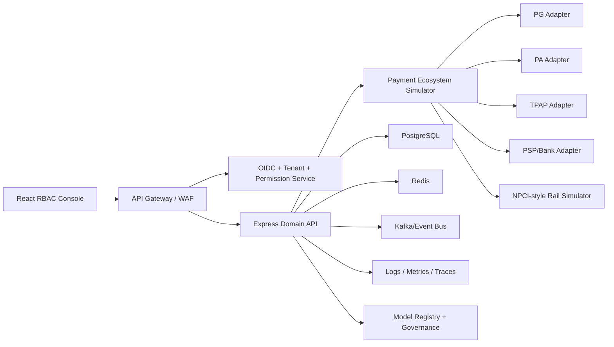

# Enterprise Architecture

The public repositories are enterprise-oriented MVPs. They demonstrate the workflow, contracts, simulator, UI, tests, and governance path. Production would replace local JSON and in-memory stores with managed cloud services and regulated integrations.

