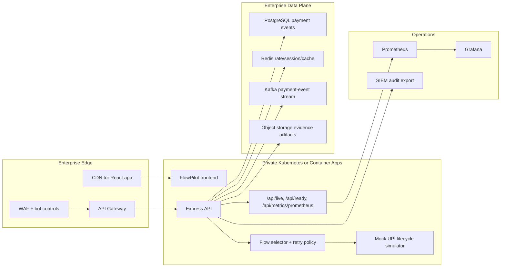

# Enterprise Cloud Deployment

Author: Prashant Jagtap <jprbom@gmail.com>

This repository is a runnable portfolio MVP today. The enterprise target is a bank/PSP-grade UPI reliability intelligence layer where FlowPilot receives checkout events, scores bank and PSP degradation, recommends the best UPI flow, and exposes operator evidence with auditability.

## Reference Architecture



## Cloud Mapping

| Layer | AWS | Azure | GCP |
| --- | --- | --- | --- |
| Frontend | CloudFront + S3 | Front Door + Static Web Apps | Cloud CDN + Cloud Storage |
| API | EKS/ECS/Fargate | AKS/Container Apps | GKE/Cloud Run |
| Database | RDS PostgreSQL | Azure Database for PostgreSQL | Cloud SQL PostgreSQL |
| Cache | ElastiCache Redis | Azure Cache for Redis | Memorystore |
| Events | MSK/SQS | Event Hubs/Service Bus | Pub/Sub |
| Secrets | Secrets Manager/KMS | Key Vault | Secret Manager/KMS |
| Observability | AMP/Grafana/CloudWatch | Azure Monitor/Grafana | Cloud Monitoring |

## Production FlowPilot Differentiators

- Bank/PSP health windows with rolling p95 latency, timeout rate, and success-rate degradation.
- Retry policy states: retry same flow, switch to intent, suggest QR, suggest UPI Lite, hold for risk, or fail fast.
- Revenue leakage estimator by merchant, bank, PSP, customer segment, and failed checkout stage.
- Payment lifecycle replay from initiated request through settlement or reversal.

## Runtime Environments

| Environment | Purpose | Data |
| --- | --- | --- |
| local | Developer demo | Synthetic JSON |
| dev | CI and QA | Seeded synthetic PostgreSQL |
| uat | Business review | Masked/synthetic traffic replay |
| prod | Enterprise target | Real tenant data, subject to bank approval |

Required variables:

```text
NODE_ENV=production
PORT=4101
CORS_ORIGIN=https://flowpilot.example.com
DATABASE_URL=postgresql://...
REDIS_URL=redis://...
KAFKA_BROKERS=broker-1:9092,broker-2:9092
OIDC_ISSUER=https://issuer.example.com
OIDC_AUDIENCE=upi-flowpilot-api
JWT_JWKS_URI=https://issuer.example.com/.well-known/jwks.json
AUDIT_EXPORT_TOPIC=flowpilot.audit.events
```

## Security Controls

The current app uses role headers for demo RBAC. Enterprise deployment must replace this with OIDC/JWT, backend role resolution, tenant isolation, immutable audit logging, idempotency keys, and maker-checker approval for policy changes.

Minimum controls:

- JWT validation against JWKS.
- Tenant ID on every record and query.
- Request correlation ID on every response.
- Idempotency key for payment lifecycle and retry requests.
- Signed callbacks for mock rail and future partner callbacks.
- KMS-backed secrets, encrypted database, TLS everywhere.
- VIEWER mutation denial tested through forged requests, not only frontend role switching.

## Data Model Target

Core production tables:

```text
tenants, users, roles, permissions
payment_events, payment_attempts, upi_lifecycle_events
bank_health_windows, psp_health_windows, routing_decisions
retry_policies, incidents, revenue_leakage_snapshots
risk_decisions, decision_reason_codes, model_versions
model_predictions, human_reviews, audit_logs
```

## Deployment Pipeline

```mermaid
flowchart LR
  DEV["Developer commit"] --> CI["Build, unit tests, audit"]
  CI --> E2E["Browser E2E + RBAC smoke"]
  E2E --> IMG["Build signed images"]
  IMG --> SCAN["SAST, dependency, container scan"]
  SCAN --> UAT["Deploy to UAT"]
  UAT --> APPROVE["Maker-checker release approval"]
  APPROVE --> PROD["Blue/green production rollout"]
  PROD --> OBS["SLO, alert, rollback monitoring"]
```



## Observability

Operational endpoints are exposed by the backend:

- `GET /api/live`
- `GET /api/ready`
- `GET /api/metrics/prometheus`

Target dashboards:

- API latency p50/p95/p99.
- Routing-decision latency.
- Mock rail response latency.
- Bank/PSP degradation incidents.
- Retry success rate and revenue recovered.
- RBAC denials and audit events.
- Model drift and threshold override rate.

## Disaster Recovery

- RPO: 15 minutes for PostgreSQL point-in-time restore.
- RTO: 60 minutes for regional failover.
- Daily encrypted backup restore drill.
- Multi-AZ PostgreSQL, Redis with persistence, Kafka replicated topics.
- Runbook for disabling automated routing and falling back to merchant default checkout flow.

## Enterprise Readiness Checklist

- Replace JSON persistence with migrations and PostgreSQL repositories.
- Add OpenAPI contract and schema-driven response validation.
- Run E2E smoke in CI with Chrome setup.
- Add load smoke artifacts under `artifacts/`.
- Add Grafana dashboard JSON and alert rules.
- Add model card, threshold policy, and human-review governance.
- Document PSP/bank integration boundaries before any live UPI connection.
